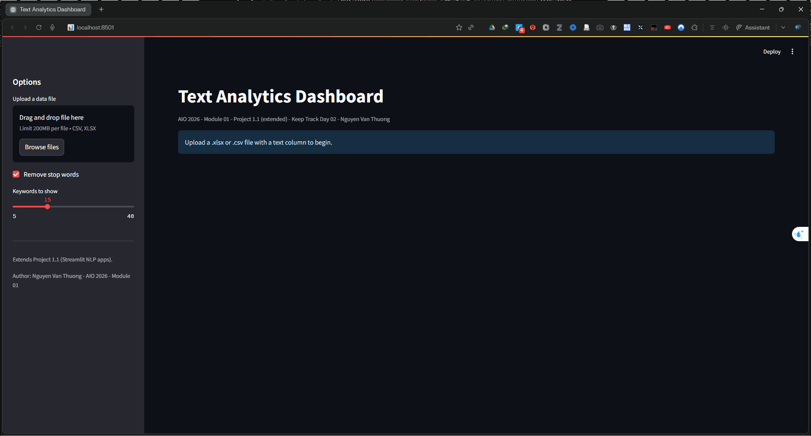

<!-- ============================================================ -->
<!--  AIO 2026 - Project 1.1 (Extended): Text Analytics Dashboard  -->
<!--  Student: Nguyen Van Thuong                                   -->
<!-- ============================================================ -->

# 📊 AIO 2026 — Project 1.1 (Extended): Text Analytics Dashboard


> 🇬🇧 **EN** — An **offline** Streamlit dashboard that profiles a free-text column in an Excel/CSV file: length statistics, per-row language detection, keyword frequency, and interactive **Plotly** charts. Built as an **extension of Project 1.1** (Module 01) and logged under **Keep Track Day 02** of AIO 2026.
>
> 🇻🇳 **VI** — Dashboard Streamlit chạy **offline**, phân tích một cột văn bản trong file Excel/CSV: thống kê độ dài, nhận diện ngôn ngữ từng dòng, đếm từ khoá và biểu đồ **Plotly** tương tác. Đây là **bản mở rộng của Project 1.1** (Module 01), ghi nhận trong **Keep Track Day 02** của AIO 2026.

**Author · Tác giả:** Nguyen Van Thuong — AIO 2026 · Module 01 · Project 1.1 (Extended)

---

## 🔗 Relation to Project 1.1 · Quan hệ với Project 1.1

- 🇬🇧 Project 1.1 ships two **online** NLP apps (translation + spell/grammar check) that call Google Translate and LanguageTool. This dashboard reuses the same Streamlit + langdetect foundation but stays **100% offline**, focusing on **text analytics** instead of translation.
- 🇻🇳 Project 1.1 gồm hai app NLP **trực tuyến** (dịch + kiểm tra chính tả/ngữ pháp) cần Google Translate và LanguageTool. Dashboard này kế thừa nền Streamlit + langdetect nhưng chạy **hoàn toàn offline**, tập trung vào **phân tích văn bản**.

🔗 **Live Streamlit App for Text Analytics Dashboard:** https://aio2026-project-11-nlp-bvlhsybdbguf7zgmqmdkhp.streamlit.app/

---

## 🎬 Demo · Minh hoạ trực quan


   
## ✨ Features · Tính năng

- Upload a `.csv` / `.xlsx` file and pick any text column to analyse.
- Per-row **character count**, **word count**, and **language detection** (langdetect, deterministic seed).
- **Keyword frequency** ranking with an optional multilingual stop-word filter.
- Three interactive **Plotly** views: word-count histogram, top-keyword bar chart, and a language donut chart.
- Export the enriched table back to **CSV** or **Excel**.
- Runs offline — no API key, no network call at runtime.

---

## 🛠️ Tech Stack · Công nghệ

| Layer · Tầng | Tool · Công cụ |
| --- | --- |
| Web framework | Streamlit |
| Data handling · Xử lý dữ liệu | pandas |
| Excel I/O | openpyxl |
| Charts · Biểu đồ | Plotly Express |
| Language detection · Nhận diện ngôn ngữ | langdetect |

---

## 📁 Project Structure · Cấu trúc dự án

```text
aio2026-project-1.1-text-analytics/
├── src/
│   └── text_analytics_dashboard.py   # Streamlit + Plotly dashboard
├── data/
│   └── sample_reviews.xlsx           # Objective multilingual sample dataset
├── assets/
│   └── demo_text_analytics_dashboard.gif # demo Gif 
├── .gitignore
├── LICENSE
├── README.md
└── requirements.txt
```

---

## 📥 Input Data Format · Định dạng dữ liệu

- Any CSV/XLSX with at least one text column (e.g. reviews, comments, questions).
- Select the text column in the sidebar after uploading.
- The bundled `data/sample_reviews.xlsx` (32 rows, multilingual, with empty cells) is provided for quick, objective testing.

---

## 🚀 Getting Started · Bắt đầu

```bash
# 1) Clone
git clone https://github.com/AIVIETNAM-AIO-ThuongNguyen/aio2026-project-1.1-text-analytics.git
cd aio2026-project-1.1-text-analytics

# 2) Virtual environment
python -m venv .venv
source .venv/bin/activate        # Windows: .venv\Scripts\activate

# 3) Install dependencies (one-time, needs internet)
pip install -r requirements.txt

# 4) Run (offline from here on)
streamlit run src/text_analytics_dashboard.py
```

### requirements.txt

```text
streamlit>=1.35
pandas>=2.0
plotly>=5.20
langdetect==1.0.9
openpyxl>=3.1
```

---

## ⚙️ Implementation Notes · Ghi chú kỹ thuật

### Performance · Hiệu năng

- 🇬🇧 Language detection is the costliest step, so it runs **once per distinct value** (deduplicated) and the whole analysis is cached with `st.cache_data`. The keyword tally is cached separately, so moving the top-N slider never recomputes it.
- 🇻🇳 Nhận diện ngôn ngữ là khâu tốn thời gian nhất nên chỉ chạy **một lần cho mỗi giá trị duy nhất** (khử trùng) và toàn bộ phân tích được cache; bảng từ khoá cache riêng nên kéo thanh trượt top-N không tính lại.

### Vietnamese without diacritics · Tiếng Việt không dấu

- 🇬🇧 `langdetect` has no model for Vietnamese typed without tone marks and often labels it French/Spanish. The app corrects this with a two-step heuristic: text containing Vietnamese letters is classified as Vietnamese immediately; otherwise a list of distinctive Vietnamese syllables (excluding English/French homographs) overrides the guess when enough syllables match.
- 🇻🇳 `langdetect` không có mô hình cho tiếng Việt không dấu nên hay nhận nhầm thành Pháp/Tây Ban Nha. App sửa bằng heuristic hai bước: có ký tự tiếng Việt thì gán ngay là tiếng Việt; nếu không, danh sách âm tiết đặc trưng (loại từ trùng với Anh/Pháp) sẽ ghi đè khi đủ số âm tiết khớp.

---

## ☁️ Deployment · Triển khai

1. Sign in to [share.streamlit.io](https://share.streamlit.io) with GitHub.
2. **New app** → select this repo → branch `main`.
3. **Main file path:** `src/text_analytics_dashboard.py` → **Deploy**.

---

## 👤 Author · Tác giả

**Nguyen Van Thuong** — AIO 2026 · Module 01 · Project 1.1 (Extended) · Keep Track Day 02

---

## 📜 License · Giấy phép

- 🇬🇧 Released under the MIT License — see the LICENSE file.
- 🇻🇳 Phát hành theo giấy phép MIT — xem file LICENSE.

---

## 🙏 Acknowledgements · Lời cảm ơn

- AI VIET NAM — AIO 2026 for the project brief and guidance.
- Open-source libraries: Streamlit, pandas, Plotly, langdetect, openpyxl.
